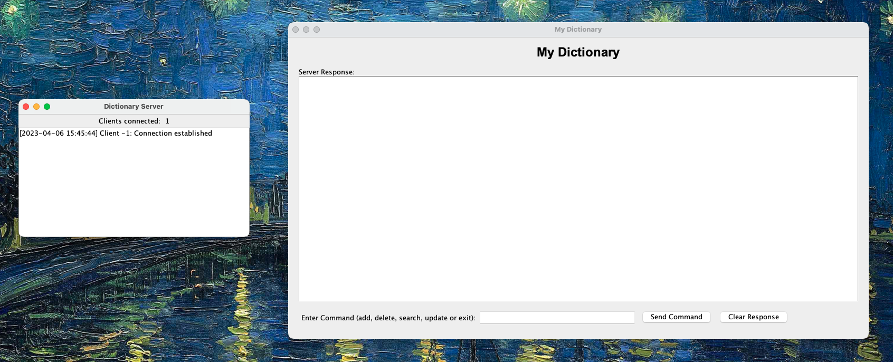
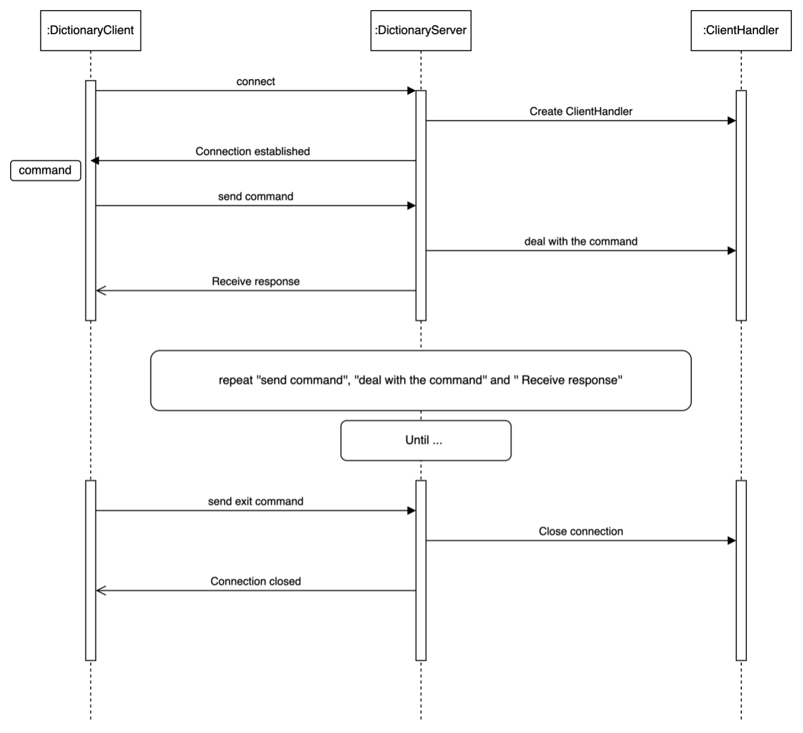
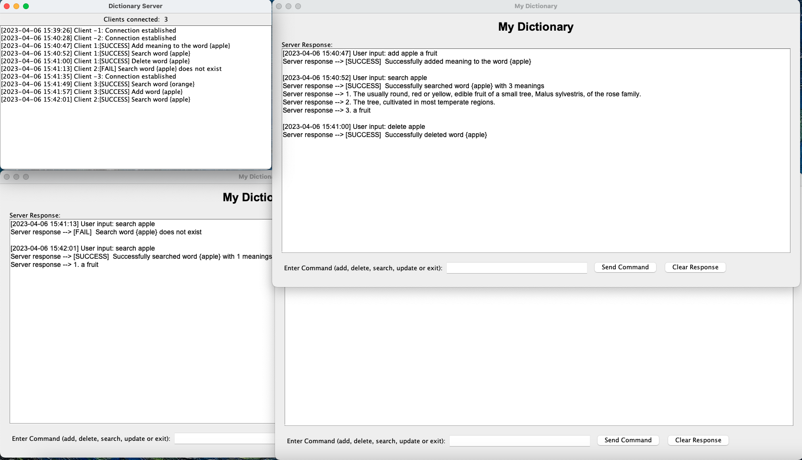

# Dictionary Server and Client

This repo is an implementation of the assignment 1 for the course **COMP90015: Distributed Systems**. The details can find in the [Assignment1.pdf](Assignment1.pdf)

---

This project consists of a simple dictionary server and client system written in Java. The server maintains a dictionary of words and their meanings, and the client can connect to the server to perform operations like adding, deleting, searching, and updating words and their meanings.

## GUI diaplay (Server & Client)


## Language & Tools

<div style="display: flex; flex-direction: row; gap: 10px;">
    
    
    
    
    
</div>


## Prerequisites

- Java Development Kit (JDK) 8 or later
- A JSON file containing the initial words and meanings for the dictionary

## Features
-  **Add** a new word along with its meaning.
-  **Delete** a word from the dictionary.
-  **Search** for a word and display its meanings.
-  **Update** the meaning of an existing word.

## Dictionary File Format

The dictionary file should be a JSON file containing a list of words and their meanings. Each word should have a unique name, and each meaning should be a string. Here is an example of a dictionary file:

```json
[
    {
    "orange": [
        "A round citrus fruit with a tough, bright reddish-yellow rind.",
        "A color between yellow and red in the spectrum."
    ],
    "apple": [
        "The usually round, red or yellow, edible fruit of a small tree.",
        "The tree, cultivated in most temperate regions."
    ]
    }
]
```

We provide a sample dictionary file in the [dictionary.json](dictionary.json) file.

## How to Compile and Run

1. Compile the server and client files:
```
cd src
```

```
javac DictionaryServer.java
javac DictionaryClient.java
 ```

 
2. Run the server with the following command, replacing `<port>` with the desired port number and `<path_to_dictionary_file>` with the path to your JSON file containing the initial dictionary:

```
java DictionaryServer <port> <path_to_dictionary_file>
```


3. Run the client with the following command, replacing `<server_address>` with the server's address and `<port>` with the port number used by the server:

```
java DictionaryClient <server_address> <port>
```

### Or

1. We also provide **Jar** file, you can run the server and client with the following command:

2. Run the server with the following command, replacing `<port>` with the desired port number and `<path_to_dictionary_file>` with the path to your JSON file containing the initial dictionary:

```
java -jar DictionaryServer.jar <port> <path_to_dictionary_file>
```


3. Run the client with the following command, replacing `<server_address>` with the server's address and `<port>` with the port number used by the server:
```
java -jar DictionaryClient.jar <server-address> <server-port>
```


## Usage

The client can send commands to the server to perform various operations on the dictionary. Here are the available commands:

- `add <word> <meaning>`: Adds a new word with the specified meaning to the dictionary. If the word already exists, the new meaning will be added to the list of existing meanings.
- `delete <word>`: Deletes the specified word and its meanings from the dictionary.
- `search <word>`: Searches for the specified word in the dictionary and returns its meanings.
- `update <word> <new_meaning>`: Updates the specified word with a new meaning, replacing the existing meanings.

To exit the client, type `exit`.


## Interaction Diagram



## Report
You can check the report in the [Report.pdf](Report.pdf)


## Example


## License
This project is open-source and free to use under the [MIT License](LICENSE).
